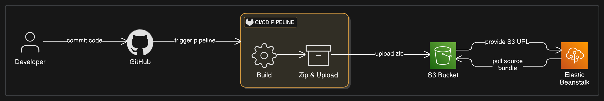

# Wordle Game (Spring Boot)

A simple web-based clone of the classic Wordle game, built with **Java**, **Spring Boot**, and **Thymeleaf**.

Players try to guess a five-letter word in up to five attempts. After each guess, feedback is provided:
- 🟩 **Green**: correct letter in the correct place
- 🟨 **Yellow**: correct letter, wrong place
- ⬜ **Gray**: letter not in the word

---

## Features

- Classic Wordle gameplay logic
- Feedback based on letter positions
- Game state maintained in session
- Clean UI styled with CSS Grid and Flexbox
- Displays game over / success message
- Input validation for 5-letter alphabetic words

---

##  Technologies Used

- Java 17+
- Spring Boot (Web)
- Thymeleaf (Template engine)
- Maven (or Gradle)
- HTML/CSS (no JS required)

---

## Deployment

